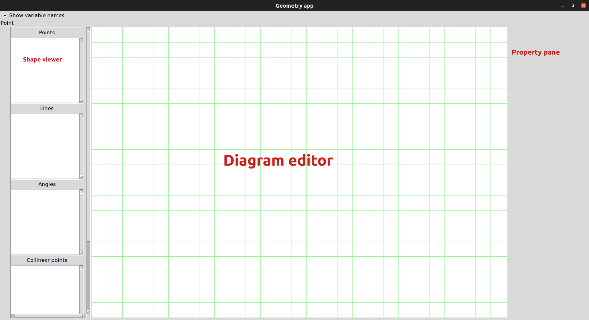

# Introduction
Geometry app is a simple GUI application to solve geometrical problems. Currently, it is in beta version, and many more features are yet to come.
# Download
Geometry app is available to download for:  
 - [Linux](https://raw.githubusercontent.com/Jothin-kumar/Geometry-app/master/Downloads/geometry_1.0.0-1_all.deb)  
 - [Windows](https://raw.githubusercontent.com/Jothin-kumar/Geometry-app/master/Downloads/geometry-app.exe)    
or, you can run the python source code directly if you have python installed:  
 - [zip](https://raw.githubusercontent.com/Jothin-kumar/Geometry-app/master/Downloads/source%20code.zip)  
 - [tar.xz for linux and mac](https://raw.githubusercontent.com/Jothin-kumar/Geometry-app/master/Downloads/source%20code.tar.xz)    
**[Contribute to Geometry app](https://github.com/Jothin-kumar/Geometry-app/blob/master/CONTRIBUTING.md)**
# User guide
## Layout

## Shapes
Currently, the following shapes are supported:  
 - Point  
 - Line  
 - Angle (autodetect)  
 - Collinear point (autodetect)  
 - Parallel lines (autodetect)  
**and many more shapes are yet to come!**
### Point:
 This is the default mode of this app. Just click a point on the diagram editor to create a point. Points are named automatically! You can rename if you want by clicking rename in the property pane. To switch between points, just click them on the list in left or on the diagram editor. You can switch to point mode by clicking point on the left side.  
 **Pro tip: press 'p' to switch to this mode.**
### Line
To draw a line, switch to line mode first by clicking line on the left side. Click on a point to start a line and click on other point to finish it. The second point would be the starting point of your next line. You can stop this by clicking somewhere on the diagram editor where a point doesn't exist.  
**Pro tip: press 'l' to switch to this mode**
### Angle
Angles are automatically detected! You can only view them in this mode. To view, just switch to this mode by clicking Angles on the left. Then, you can select an angle name from the left to highlight it.  
**Pro tip: press 'a' to switch to this mode**
### Collinear points
Collinear points are automatically detected! Just click collinear points and select a collinear points list. It will be highlighted!  
**Pro tip: press 'c' to switch to this mode**
### Parallel lines
Parallel lines are automatically detected! Just click parallel lines and select a list. It will be highlighted!  
**Pro tip: press 'r' to switch to this mode***
